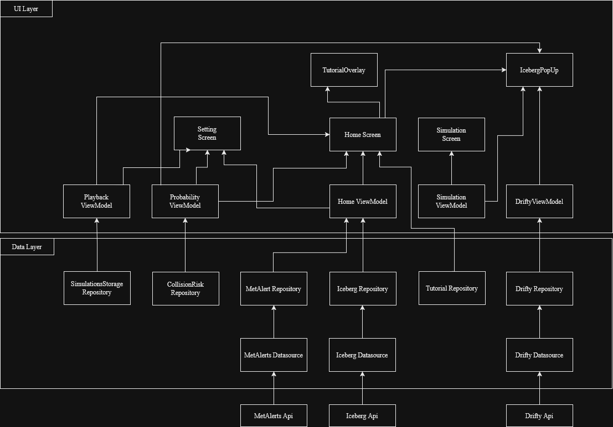

# Arkitektur – Team 44

Dette dokumentet er ment for utviklere som skal sette seg inn i, vedlikeholde eller bygge videre på appen.

---



---

## Mappestruktur

Prosjektet er delt inn i tre hovedlag: `data`, `model` og `ui`, pluss en `util`-pakke for hjelpefunksjoner.

```
src/main/java/no/uio/ifi/in2000/sofiaalo/team44/
├── data/         ← Datahenting og -lagring
├── model/        ← Dataklasser og domeneobjekter
├── ui/           ← Composables og ViewModels
├── util/         ← Hjelpefunksjoner
└── MainActivity.kt / ScreenNavigation.kt
```

Under `data` og `ui` er koden videre delt per funksjonalitetsområde (`iceberg`, `drifty`, `metAlerts`, osv.), slik at alt som hører til én feature ligger samlet.

---

## MVVM og UDF

Appen bruker MVVM med unidirectionell dataflyt: UI sender hendelser til ViewModel, ViewModel oppdaterer state, UI tegner seg på nytt basert på state. Ingen state flyter andre veien.


For nettverkskall i `HomeViewModel` (isfjell og farevarsler) brukes en sealed class for å håndtere lasting/feil:

```kotlin
sealed class UiState<out T> {
    object Idle : UiState<Nothing>()
    object Loading : UiState<Nothing>()
    data class Success<T>(val data: T) : UiState<T>()
    data class Error(val exception: Throwable) : UiState<Nothing>()
}
```

### ViewModels

- **HomeViewModel** – hovedskjermens tilstand: isfjell, farevarsler, skipsrute og valgt tidspunkt
- **DriftyViewModel** – håndterer simuleringsflyt og nedlasting av NetCDF-filer
- **FavoritesViewModel** – laster og sletter lagrede simuleringer
- **PlaybackViewModel** – tidslinje-animasjon og avspillingsmodus
- **ProbabilityViewModel** – beregner og viser kollisjonssannsynlighet

`HomeViewModel` og `PlaybackViewModel` utvider `AndroidViewModel` fordi de trenger `Application`-kontekst for fillagring.

Lagdelingen bidrar til lav kobling og høy kohesjon: ViewModels vet ikke om konkrete repository-implementasjoner, 
og hver klasse har ett klart ansvar – `DriftyDataSource` gjør kun HTTP-kall, `DriftyRepositoryImp` håndterer simuleringslogikk,
og `DriftyViewModel` tar seg av state og koordinering mot UI.

---

## Datalaget

All datahenting går via repository-grensesnitt. ViewModels avhenger av grensesnittet, ikke den konkrete implementasjonen – det gjør det enkelt å mocke i tester og bytte datakilde uten å røre UI-koden.

Flyten er: `ViewModel → Repository (interface) → RepositoryImp → DataSource → API`

Repositories og hva de gjør:

- `IcebergRepository` – henter isfjell-GeoJSON og filtrerer duplikater
- `DriftyRepository` – POST-kall til Drifty, poller status med Flow, håndterer feil og timeout
- `MetAlertsRepository` – farevarsler fra Met.no
- `SimulationStorageRepository` – lagrer og leser NetCDF-filer fra Drifty
- `FileStorageRepository` – abstraksjon over lokal fillagring (brukes av SimulationStorage)
- `CollisionRiskRepository` – Haversine-basert beregning av kollisjonssannsynlighet
- `TutorialRepository` – fungerer som et lokalt repository som håndterer om tutorial skal vises
  
### API-er

| API                             | Bruk                                 |
|---------------------------------|--------------------------------------|
| Drifty (`in2000.drifty.met.no`) | Isfjell-simuleringer (obligatorisk)  |
| Met.no MetAlerts                | Marine farevarsler (obligatorisk)    |
| Isfjell-API                     | Isfjell-observasjoner (obligatorisk) |
| Victoria WMS                    | Iskart som kartlag                   |


---
## Navigasjon

Jetpack Compose `NavHost` i `ScreenNavigation.kt` med tre ruter: `home`, `simulerte isfjell` og `Instillinger`. `MenuBar`-komponenten nederst styrer navigasjonen.

---

## IcebergPopup

`IcebergPopUp`-komponenten brukes til å vise informasjon om et spesifikt isfjell når en bruker trykker polygonet til det isfjellet.

---
## Kartinteraksjon og arkitektoniske avvik

I den nåværende implementasjonen inneholder `HomeViewModel` funksjonen `updateShipMarker`, som tar inn kartets `Style` og en Android `Context` for å manipulere kartmarkører for skipet direkte fra logikklaget.

* **Refleksjon:** I henhold til offisielle retningslinjer for ren Android-arkitektur og Unidireksjonell Dataflyt (UDF), bør en ViewModel holdes fullstendig uavhengig av UI-spesifikke klasser (`Style`) og livssyklus-kontekster (`Context`). Dette øker koblingen (coupling) mellom lagene og gjør enhetstesting vanskelig. En fremtidig forbedring av appen ville vært å flytte denne logikken ut til selve kartkomponenten (UI-laget), slik at ViewModel kun eksponerer råposisjoner (`LatLon`) som en ren tilstand (state), som kartet så lytter og reagerer på.

---
## Tutorial

For å gi nye brukere en introduksjon til appens kjernefunksjoner, bruker vi en `TutorialOverlay` som tegnes som et veiledende lag over hovedskjermen.
Om introduksjonen skal vises eller ikke, styres av datalaget gjennom klassen `TutorialRepository`. Denne bruker **Jetpack DataStore Preferences** til å lagre en boolsk verdi lokalt på enheten, slik at brukeren slipper å se introduksjonen hver gang appen åpnes. Tilstanden eksponeres som en `Flow` til `HomeViewModel`, som igjen sender dette videre til UI-et via en `StateFlow` (`seen`). UI-et bruker `AnimatedVisibility` for en fin inn og ut.

For å initialisere `TutorialRepository` (og håndtere lokal fillagring i `PlaybackViewModel`), har vi i denne versjonen valgt å la disse klassene utvide `AndroidViewModel` i stedet for en ren `ViewModel`.
* **Hvorfor:** Dette gir oss direkte og enkel tilgang til `Application`-konteksten, som er nødvendig for at DataStore og den interne filstrukturen skal kunne bruke enhetens filsystem. Siden prosjektet ikke tar i bruk tyngre rammeverk for Dependency Injection (som Hilt), var dette den mest enkle og oversiktlige måten å løse kontekst-behovet på innenfor tidsrammen for prosjektet.
* **Refleksjon:** Googles arkitekturanbefalinger fraråder bruk av `AndroidViewModel` fordi det gjør enhetstesting vanskeligere og binder arkitekturen tett til Android-rammeverket. Det ideelle mønsteret (og neste naturlige steg for appen) ville vært å bruke en ren `ViewModel`, flytte DataStore-avhengigheten helt ut til datalaget (Repositories), og sende dette ferdig instansiert inn i ViewModel via en `ViewModelProvider.Factory` i `MainActivity`.
---
## UI-Lagdeling

1. **Hovedinnhold (Nederst):** `ScreenNavigation` (inkludert MapLibre-kartet) fyller hele skjermen og ligger i bunnen for å kunne motta klikk og bevegelser overalt.
2. **Interaktive overlegg (Midten):** `IcebergPopUp` ligger over kartet, men under introduksjonen. Den rendres kun når en tilstand i `HomeViewModel` tilsier at et isfjell er valgt.
3. **Globale overlegg (Øverst):** `TutorialOverlay` ligger helt øverst på Z-aksen for å sikre at introduksjonen dekker alt annet innhold og fanger oppmerksomheten til brukeren når appen åpnes for første gang.

For å forhindre at lagene over kartet blokkerer for klikk når de er usynlige, brukes Compose-mekanismer som `AnimatedVisibility` eller betinget rendring (`if`-setninger). Dette sikrer at lagene fjernes helt fra komposisjonstreet når de ikke er i bruk, slik at kartet forblir klikkbart.

---

## Biblioteker

**Ktor** brukes som HTTP-klient i stedet for Retrofit fordi det er Kotlin-first og støtter coroutines direkte. Drifty-APIet krever også Basic Auth, som Ktor håndterer ryddig med en egen plugin.

**MapLibre GL** brukes for kartet. Vi vurderte Google Maps, men MapLibre er åpen kildekode og støtter egendefinerte kartlag uten lisenskostnader – nødvendig for iskart og simuleringsvisning.

**NetCDF/CDM** brukes for å lese `.nc`-filer som Drifty returnerer. NetCDF er et binært format for matrisedata og kan ikke leses som vanlig tekst.

Øvrige biblioteker: Kotlinx Serialization (JSON), Coil (bildeinnlasting), DataStore Preferences (innstillinger), Jetpack Navigation.

---

## Kodestil og praksis

Kode-identifikatorer (klasser, funksjoner, variabler) er på engelsk, mens UI-strenger og kommentarer er på norsk siden appen er rettet mot norske brukere.

Prosjektet bruker Android Studios innebygde automatiske formatering. Nye filer bør følge samme mønster som eksisterende: én klasse per fil, ViewModels i samme mappe som tilhørende skjerm, og gjenbrukbare komponenter i `ui/components`.

---

## API-nivå

Vi valgte å sette minSdk til 29 (Android 10). Det gir oss tilgang til nyere API-er uten ekstra konfigurasjon, blant annet `java.time` for dato- og tidshåndtering, som er anbefalt av Google.
Per desember 2025 kjører ca. 90,7 % av aktive Android-enheter API 29 eller høyere, så vi ekskluderer svært få brukere. Kilde: https://composables.com/android-distribution-chart

---
