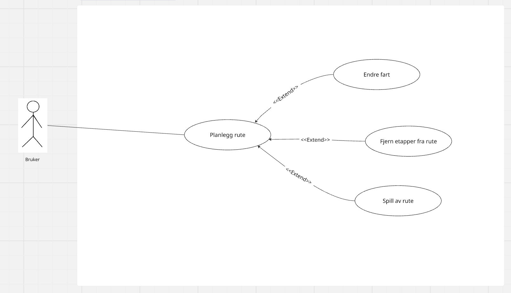
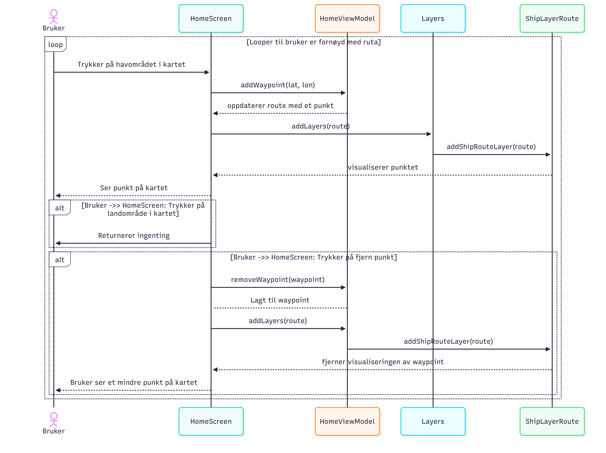
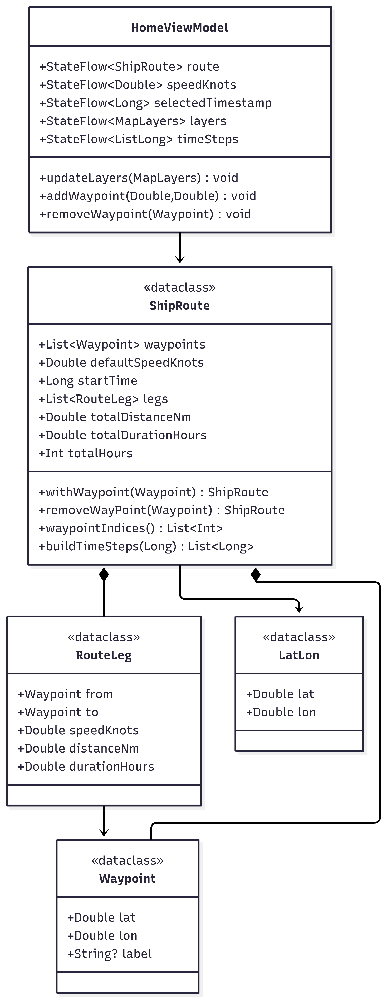
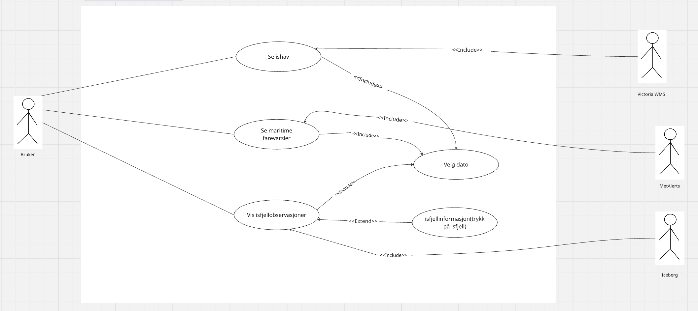
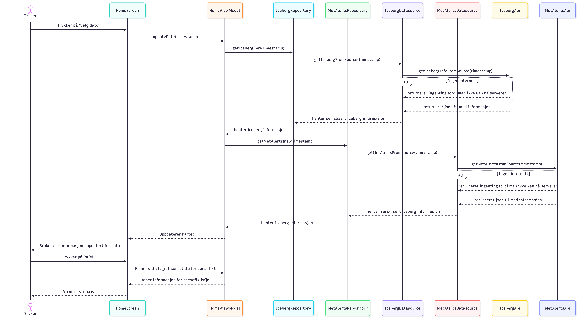
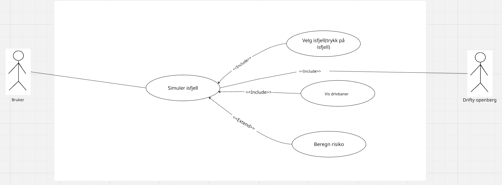
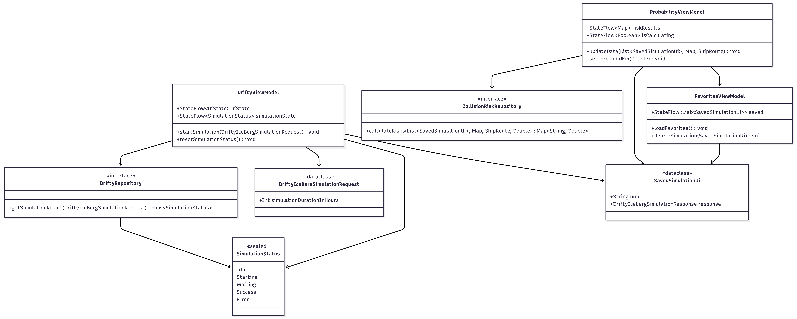

# Modellering
For case 2. "Redd Titanic!" hadde vi tre obligatoriske krav.
- Plotting av skipskurs
- Visning av isfjellobservasjoner
- Simulering av isfjell
Vi har brukt use case diagrammer for å beskrive de tre kravene, samt en tekstlig beskrivelse av use
casene. For å få frem andre perspektiver har vi også lagd aktivitetsdiagrammer for de tre
obligatoriske kravene. Vi bruker disse diagrammenene for å tydeliggjøre appens viktigste
funksjonalitet og kommunisere disse på en enkel måte slik at vi får en bedre forståelse av
systemkravene og den overordende flyten fra bruker perspektivet. Vi har også lagd sekvensdiagram som sier noe om 
hvilke klasser, objekter og funksjoner interagerer med hverandre når applikasjonen blir brukt. 
Sekvensdiagrammet abstraherer use case beskrivelsen til et perspektiv over bakgrunnslogikken i applikasjonen.

### Interkasjonsbeskrivelse: USE CASE 1
Vi realiserer første funksjonelle krav, plotting av skipskurs, gjennom en brukerinterasjon som
forklares her: Bruker ønsker å plotte skipskurs fra A til B, og se kursen visuelt på kartet.
Bruker starter med å interagere med kartet, ved å trykke på ønskede punkter(waypoints) på kartet.
Når bruker trykker på punkter, skal systemet vise en rød pin der bruker har trykket. Når bruker
trykker på minst to punkter, vil systemet lage en linje mellom punktene. Hvis bruker trykker feil
kan bruker fjerne punktet ved å dra opp en slide-sheet hvor alle etapper(linjer) vil ligge synlige.
Etter at bruker har valgt alle ønskede punkter, vil bruker ha en synlig rute på kartet med punkter
og etapper.

#### Tekstlig beskrivelse USE CASE 1
Navn: Planlegg rute
Prebetingelse: Ingen
Postbetingelse: Rute er synlig på kartet med de waypoints bruker har valgt

Hovedflyt:
1. Bruker trykker på et sted på kartet
2. Systemet legger til et waypoint 
3. Bruker trykker på et nytt sted på kartet
4. Systemet legger til et nytt waypoint og tegner en blå linje mellom waypointene(etappe 1)
5. Bruker trykker på enda et sted på kartet
6. System legger til waypointen og tegner en blå linje mellom waypoint to og tre(etappe 2)
7. Systemet viser etappene og punktene bruker har valgt på kartet

Alternativflyt:
3.1 Bruker har trukket på feil området på kartet
3.2 Bruker scroller opp på bottomsheet
3.3 Systemet viser en oversikt over alle etappene som er lagt inn
3.4 Bruker trykker på "fjern" på siste etappe som ble lagt inn
3.5 Systemet fjerner etappen fra oversikten og kartet
3.6 Bruker drar ned bottomsheet for å se hele kartet igjen og fortsetter på steg 4

Use-Case Diagram 1:
Path: app/src/main/res/drawable/use_case_diagram_1.png

Sekvensdiagram 1:
Path: app/src/main/res/drawable/sekvensdiagram_usecase1_png.png

Klassediagram 1:
Path: app/src/main/res/drawable/klassediagram_usecase1.png

### Interkasjonsbeskrivelse: USE CASE 2
For use case to beskriver vi det andre funksjonelle kravet her: Bruker ønsker å se isfjell på
kartet, samt informasjon om isfjellet(posisjon, sist observert osv). Bruker starter ved å velge
dato og tidspunkt for isfjellobservasjoner. Heretter skal bruker få opp isfjell "figurer" på kartet,
for de isfjellene som er observert på den valgte datoen og tidspunktet. Bruker ønsker informasjon
om et isfjell og trykker da på det isfjellet. Systemet vil vise et popup-vindu med informasjon om
det valgte isfjellet.

#### Tekstlig beskrivelse USE CASE 2
Navn: Se isfjellobservasjoner
Prebetingelse: Trenger internett
Postbetingelse: Isfjell synlig på kartet

Hovedflyt:
1. Bruker trykker på "velg dato"
2. Systemet viser et popup-vindu med kalender
3. Bruker velger en dato og klikker "ok"
4. Systemet viser et annet popup-vindu med tidspunkt
5. Bruker velger et ønsket tidspunkt og klikker ok
6. Systemet visualiserer isfjellene(på kartet) som er observert på gitt dato og tidspunkt
7. Bruker trykker på et tilfeldig isfjell
8. Systemet viser en popup-sheet med isfjell-informasjon

Alternativflyt:
6.1 Systemet viser ikke isfjell på kartet
6.2 Bruker går tilbake til steg 1, følger stegene og velger annen dato eller tidspunkt

Use-Case Diagram 2:
Path: app/src/main/res/drawable/use_case_diagram_2.png

Sekvensdiagram 2:
Path: app/src/main/res/drawable/sekvensdiagram_usecase2_png.png

### Interkasjonsbeskrivelse: USE CASE 3
For det siste funksjonelle kravet, simulering av isfjell-baner i forhold til ruta, beskrives her:
Bruker har laget en rute og valgt dato for isfjellobservasjoner. Bruker ønsker å se om et gitt
isfjell vil være trygt eller ikke i forhold til ruta. Bruker trykker på isfjellet og får opp et
popup-vindu med isfjellinformasjon og en "Start isfjell-simulering" knapp. Her må bruker først
velge simuleringstid og deretter starte simuleringen. Bruker venter da til hen får en bekreftelse
av systemet. Bruker trykker deretter på "simuleringer" i menybaren hvor bruker aktiverer
simuleringen. Bruker går tilbake til hjem siden og trykker deretter på risikoanalys(varseltrekant
ikonet) og der vil systemet bekrefte om isfjellet er trygt eller ikke i forhold til ruta.

#### Tekstlig beskrivelse USE CASE 3
Navn: Kjøre isfjell-bane simulering og se om isfjellet er trygt eller ikke i forhold til ruta
Prebetingelse: Må ha lagt inn en rute og valgt dato for isfjell observasjon(use case 1 og 2)
Postbetingelse: Se om isfjell er trygt eller ikke på ruta som er lagd

Hovedflyt:
1. Bruker trykker på et isfjell som ligger nær ruta
2. System viser en popup med isjfell informasjon, antall timer for simuerling(standard 12 timer) og
en "start" simulering knapp
3. Bruker velger standard tid og trykker på start
4. Systemet viser en dynamisk linje med hvor mye tid som er igjen til simuelring er ferdig
5. System bekrefter fullført simulering
6. Bruker trykker seg inn på "simuleringer" og aktiverer isfjellet
6. Systemet vil legge til dette i risikoanalysen
7. Bruker trykker på knappen med "varseltrekant" ikonet hvor risikoanalysen ligger
7. Systemet viser et slide popup-vindu(Risikoanalyse) med informasjon om isfjellet er trygt/utrygt

Use-Case Diagram 3:
Path: app/src/main/res/drawable/use_case_diagram_3.png

Klassediagram 3:
Path: app/src/main/res/drawable/klassediagram_usecase3.png

