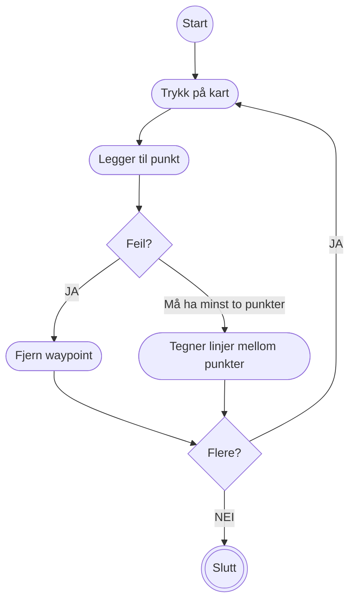

USE CASE 1 - Planlegg rute

```mermaid

    flowchart TD;

        start((Start))

        kartTrykk([Trykk på kart])

        leggTilWaypoint([Legger til punkt])

        tegnLinjer([Tegner linjer mellom punkter])

        fjern([Fjern waypoint])

        flere{Flere?}

        feil{Feil?}

        start --> kartTrykk

        kartTrykk --> leggTilWaypoint

        flere --JA--> kartTrykk

        flere --NEI--> slutt

        leggTilWaypoint --> feil

        feil --JA--> fjern

        feil --Må ha minst to punkter--> tegnLinjer

        fjern --> flere

        tegnLinjer --> flere

        slutt(((Slutt)))

```