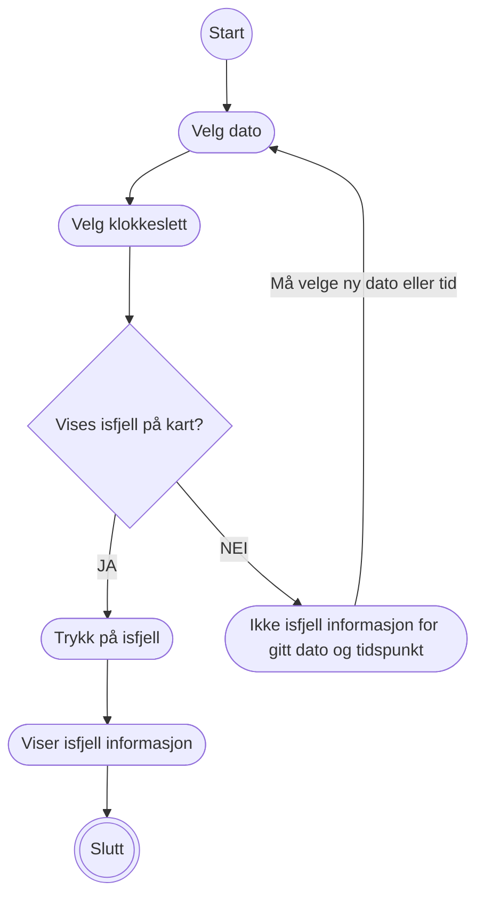

USE CASE 2 - Se isfjellobservasjoner

```mermaid

    flowchart TD;
        start((Start))

        velgDato([Velg dato])

        velgKlokkeslett([Velg klokkeslett])

        visIsfjell{Vises isfjell på kart?}

        trykkPåIsfjell([Trykk på isfjell])

        visIsfjellInformasjon([Viser isfjell informasjon])

        ikkeIsfjell([Ikke isfjell informasjon for gitt dato og tidspunkt])

        start --> velgDato

        velgDato --> velgKlokkeslett

        velgKlokkeslett --> visIsfjell

        ikkeIsfjell --Må velge ny dato eller tid--> velgDato

        visIsfjell --JA--> trykkPåIsfjell

        visIsfjell --NEI--> ikkeIsfjell

        trykkPåIsfjell --> visIsfjellInformasjon

        visIsfjellInformasjon --> slutt

        slutt(((Slutt)))


```