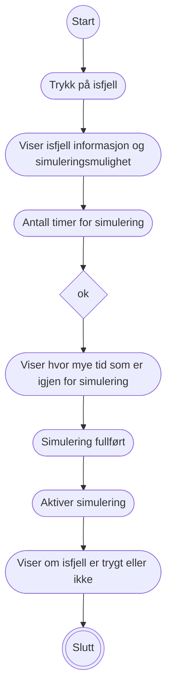

USE CASE 3 - Kjøre isfjell-bane simulering og se om isfjellet er trygt eller ikke i forhold til ruta

```mermaid
    flowchart TD;

        start((Start))

        trykkPåIsfjell([Trykk på isfjell])

        visIsfjellInformasjonOgSimulering([Viser isfjell informasjon og simuleringsmulighet])

        velgTimer([Antall timer for simulering])

        ok{ok}

        tidIgjen([Viser hvor mye tid som er igjen for simulering])

        fullført([Simulering fullført])

        aktiverSimulering([Aktiver simulering])

        trykkPåVarseltrekant([Viser om isfjell er trygt eller ikke])

        start --> trykkPåIsfjell

        trykkPåIsfjell --> visIsfjellInformasjonOgSimulering

        visIsfjellInformasjonOgSimulering --> velgTimer

        velgTimer --> ok

        ok --> tidIgjen

        tidIgjen --> fullført

        fullført --> aktiverSimulering

        aktiverSimulering --> trykkPåVarseltrekant

        trykkPåVarseltrekant --> slutt
        
        slutt(((Slutt)))


```