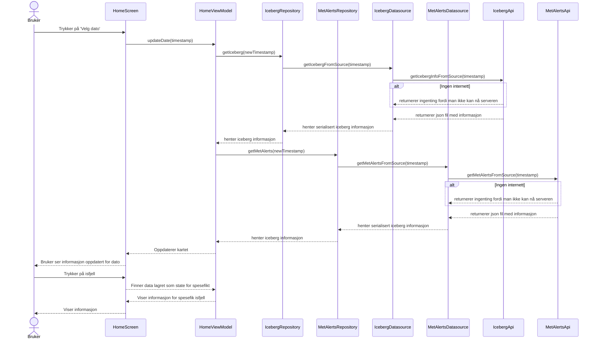

```mermaid

sequenceDiagram
    actor Bruker
    participant HomeScreen
    participant HomeViewModel
    participant IcebergRepository 
    participant MetAlertsRepository 
    participant IcebergDatasource
    participant MetAlertsDatasource
    participant IcebergApi
    participant MetAlertsApi

    Bruker ->> HomeScreen: Trykker på 'Velg dato'
    HomeScreen ->> HomeViewModel: updateDate(timestamp)
    HomeViewModel ->> IcebergRepository: getIceberg(newTimestamp) 
    IcebergRepository ->> IcebergDatasource: getIcebergFromSource(timestamp) 
    IcebergDatasource ->> IcebergApi: getIcebergInfoFromSource(timestamp)
    
    alt Ingen internett
    IcebergApi -->> IcebergDatasource: returnerer ingenting fordi man ikke kan nå serveren
    end

    IcebergApi -->> IcebergDatasource: returnerer json fil med informasjon
    IcebergDatasource -->> IcebergRepository: henter serialisert iceberg informasjon 
    IcebergRepository -->> HomeViewModel: henter iceberg informasjon

    HomeViewModel ->> MetAlertsRepository:  getMetAlerts(newTimestamp)
    MetAlertsRepository ->> MetAlertsDatasource:  getMetAlertsFromSource(timestamp)
    MetAlertsDatasource ->> MetAlertsApi:  getMetAlertsFromSource(timestamp)

    alt Ingen internett
    MetAlertsApi -->> MetAlertsDatasource: returnerer ingenting fordi man ikke kan nå serveren
    end

    MetAlertsApi -->> MetAlertsDatasource: returnerer json fil med informasjon
    MetAlertsDatasource -->> MetAlertsRepository: henter serialisert iceberg informasjon 
    MetAlertsRepository -->> HomeViewModel: henter iceberg informasjon

    HomeViewModel -->> HomeScreen: Oppdaterer kartet
    HomeScreen -->> Bruker: Bruker ser informasjon oppdatert for dato
    Bruker ->> HomeScreen: Trykker på isfjell
    HomeScreen -->> HomeViewModel: Finner data lagret som state for spesefikt
    HomeViewModel -->> HomeScreen: Viser informasjon for spesefik isfjell
    HomeScreen -->> Bruker: Viser informasjon

```

